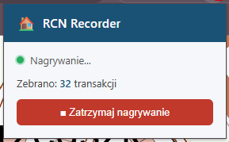
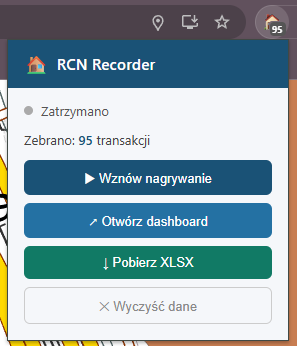
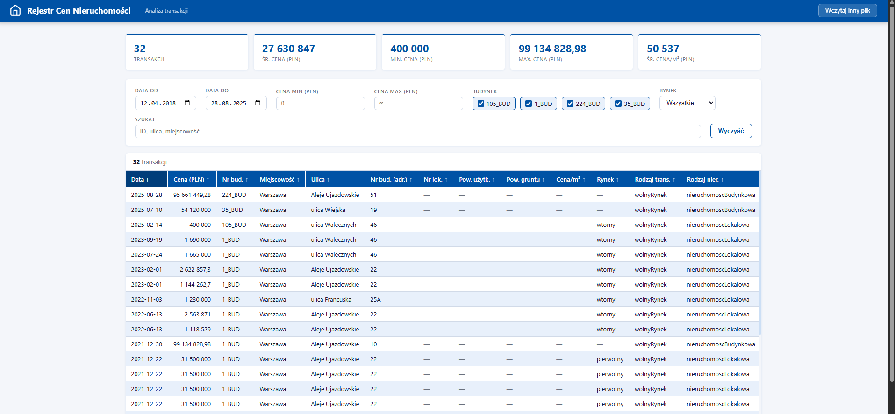

# RCN Parser + Recorder

Tools for collecting and analysing real estate transactions from the Polish
**Rejestr Cen Nieruchomości** (Real Estate Price Register) available at
[https://mapy.geoportal.gov.pl/imapnext/imap](https://mapy.geoportal.gov.pl/imapnext/imap).

Two independent tools that share the same 21-column XLSX schema:

| Tool | Use case |
|------|----------|
| `parse.js` | Batch-convert saved HTML exports → timestamped XLSX |
| `rcn-extension/` | Chrome extension — capture transactions live on the map |
| `rcn-extension-firefox/` | Firefox extension — same code, Firefox-specific manifest only |
| `dashboard.html` | Offline dashboard — load any output XLSX for filtering/viewing |

---

## Requirements

- **Node.js** ≥ 18
- **Chrome** ≥ 111 (for the Chrome extension)
- **Firefox** ≥ 128 (for the Firefox extension)

---

## 1 — Batch Parser

Converts HTML exports downloaded from geoportal.gov.pl into a single XLSX file.

### Setup

```bash
npm install
```

### Usage

1. Place downloaded HTML files in the `parse-in/` folder
2. Run the parser:

```bash
npm run parse
# or: node parse.js
```

Output is saved to `parse-out/YYYYMMDD-HHmmss.xlsx`.
Open the file directly in Excel, or load it into `dashboard.html` for an
interactive offline view.

---

## 2 — Chrome / Firefox Extension (live capture)

Records transactions in real time as you click buildings on the map, with
automatic deduplication. Downloads all collected data as XLSX.

### First-time setup

Copy the bundled XLSX library into the extension (requires `npm install` first):

```bash
# Windows
copy node_modules\xlsx\dist\xlsx.full.min.js rcn-extension\lib\

# macOS / Linux
cp node_modules/xlsx/dist/xlsx.full.min.js rcn-extension/lib/
```

### Load in Chrome

1. Open `chrome://extensions`
2. Enable **Developer mode** (toggle in the top-right corner)
3. Click **Load unpacked** and select the `rcn-extension/` folder

The house icon appears in the Chrome toolbar.

### Load in Firefox

Assemble the Firefox extension folder by copying the Chrome extension files into it, then
restore the Firefox-specific manifest (the copy step overwrites it with the Chrome one):

```bash
# Windows
xcopy /E /Y rcn-extension\* rcn-extension-firefox\
git checkout rcn-extension-firefox\manifest.json

# macOS / Linux
cp -r rcn-extension/* rcn-extension-firefox/
git checkout rcn-extension-firefox/manifest.json
```

> `rcn-extension-firefox/manifest.json` is the only file committed in that folder.
> All other files are copied from `rcn-extension/` and are git-ignored.

Then load in Firefox:

1. Open `about:debugging` → **This Firefox**
2. Click **Load Temporary Add-on…**
3. Select `rcn-extension-firefox/manifest.json`

The icon appears in the Firefox toolbar.

### Usage

1. Navigate to [mapy.geoportal.gov.pl](https://mapy.geoportal.gov.pl)
2. Open the extension popup → click **▶ Rozpocznij nagrywanie**
3. Click buildings on the map — transactions are captured automatically
4. Click **↓ Pobierz XLSX** to download

The badge shows `●` while recording and the transaction count when stopped.

---

## XLSX Column Schema

Both tools produce files with this 21-column layout:

| Column | Description |
|--------|-------------|
| Plik źródłowy | Source filename or `"live"` for extension captures |
| Nr budynku | Building label (e.g. `1_BUD`) |
| ID transakcji | UUID — used for deduplication in the extension |
| Data transakcji | Transaction date (`YYYY-MM-DD`) |
| Cena (PLN) | Sale price |
| Rodzaj transakcji | Transaction type |
| Rodzaj rynku | Market type (primary / secondary) |
| Sprzedający | Seller |
| Kupujący | Buyer |
| Rodzaj nieruchomości | Property type |
| Prawo | Legal title |
| Udział | Ownership share |
| Pow. gruntu (m²) | Land area |
| ID budynku | Building ID |
| Rodzaj budynku | Building type |
| Pow. użytkowa (m²) | Usable floor area |
| Miejscowość | City / town |
| Ulica | Street |
| Nr budynku adres | Building number |
| Nr lokalu | Apartment number |
| Cena/m² (PLN) | Price per m² (computed from usable area, or land area as fallback) |

---

## Project Structure

```
.
├── parse-in/               # Place HTML exports here (not committed by default)
├── parse-out/              # Timestamped XLSX output (git-ignored)
├── parse.js                # Batch parser
├── dashboard.html          # Standalone offline dashboard
├── icon.png                # Extension icon source
├── make_icons.js           # Regenerate extension icons from icon.png: node make_icons.js
├── rcn-extension/
│   ├── manifest.json       # Chrome MV3 manifest (service_worker)
│   ├── background.js       # Service worker: state, badge, messaging
│   ├── interceptor.js      # MAIN world: patches fetch + XHR
│   ├── bridge.js           # ISOLATED world: HTML parsing, relay to background
│   ├── popup.html / .js    # Extension popup UI
│   ├── dashboard.html      # Dashboard opened via popup button (uses local lib/)
│   ├── dashboard.js        # Dashboard logic (extracted for MV3 CSP compliance)
│   ├── icons/              # PNG icons (16, 32, 48, 128 px)
│   └── lib/                # xlsx.full.min.js — copy from node_modules (see setup)
├── rcn-extension-firefox/
│   └── manifest.json       # Firefox MV3 manifest (scripts + gecko settings)
│                           # All other files are copied from rcn-extension/ — see setup
└── package.json
```

## Screenshots





